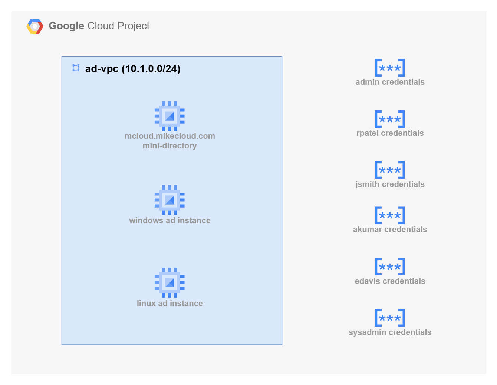

# GCP Mini Active Directory  

This project is a follow-up to our full **Google Cloud Managed Microsoft AD** project. While managed AD services are well-suited for production, they can be expensive for prototyping and require long provisioning times. The **“mini-AD”** approach provides a faster, lower-cost alternative that delivers a fully functional Active Directory environment that builds much quicker.  

Using **Terraform, Samba 4, and automated configuration scripts**, this deployment provisions an **Ubuntu-based Compute Engine VM** that serves as both a **Domain Controller and DNS server**. It integrates into a custom **Google Cloud VPC** with private subnets, **firewall rules** for AD/DC traffic, and **Secret Manager** for secure credential storage.  

Once the infrastructure is deployed, additional **Windows and Linux VMs** are provisioned into the same VPC and automatically joined to the domain at boot. The join process is handled by custom scripts (`ad_join.ps1` for Windows and `ad_join.sh` for Linux) that configure authentication and domain integration.  

This solution is ideal for **labs, demos, and development environments** where Active Directory integration is needed without the cost and provisioning time of Google Managed Microsoft AD. It is **not intended for production use**, but provides a complete, repeatable environment for testing AD-connected workloads in GCP.  

See the `Limitations` section for a list of caveats.  

  

## Limitations  

While the GCP mini-AD deployment provides a functional and cost-effective Active Directory environment for labs, demos, and development, it does not include many of the advanced features found in **Google Cloud Managed Microsoft AD** or a fully managed Windows Server AD deployment:  

### Issues Related to PaaS vs IaaS (Operational & Platform-Level)  
- **High Availability & Multi-Region** – Managed Microsoft AD provisions redundant domain controllers across zones automatically; mini-AD is a single VM without failover.  
- **Automated Backups & Snapshots** – Managed AD handles scheduled backups; mini-AD requires manual snapshots or custom backup workflows.  
- **Automatic Patching** – Managed AD auto-patches Windows Server and AD services; mini-AD requires manual updates of Ubuntu, Samba, and Kerberos.  
- **Security Hardening & Compliance** – Managed AD is pre-hardened and validated for compliance frameworks; mini-AD security depends entirely on your configuration.  
- **24/7 Google Support** – Managed AD includes full Google Cloud support; mini-AD requires you to manage and troubleshoot all aspects yourself.  
- **Monitoring & Metrics** – Managed AD integrates with Cloud Monitoring and Logging; mini-AD requires you to manually configure monitoring and log forwarding.  

### Functional Differences (AD Feature Gaps & Compatibility)  
- **Google Cloud Service Integration** – Managed AD integrates natively with services such as Filestore, SQL Server on GCE, and GKE; mini-AD requires additional configuration to enable these integrations.  
- **Group Policy Objects (GPOs)** – Managed AD supports full Windows GPOs; Samba’s GPO support is limited and lacks multi-DC replication.  
- **PowerShell AD Cmdlets** – Managed AD exposes AD Web Services for remote management; Samba mini-AD does not support native AD PowerShell cmdlets.  
- **Kerberos Trusts with On-Prem AD** – Managed AD supports domain and forest trusts; mini-AD requires manual Kerberos/LDAP configuration, which is complex and limited.  
- **No Google Identity (Cloud Identity / Workspace) Integration** – Mini-AD cannot integrate with Google Identity or Cloud IAM. This prevents seamless SSO, conditional access, and native identity federation with Google Workspace or IAM-controlled resources.  

## Prerequisites

* [A Google Cloud Account](https://console.cloud.google.com/)
* [Install gcloud CLI](https://cloud.google.com/sdk/docs/install) 
* [Install Latest Terraform](https://developer.hashicorp.com/terraform/install)

If this is your first time watching our content, we recommend starting with this video: [GCP + Terraform: Easy Setup](https://youtu.be/3spJpYX4f7I). It provides a step-by-step guide to properly configure Terraform, Packer, and the gcloud CLI.

## Download this Repository  

Clone the repository from GitHub and move into the project directory:  

```bash
git clone https://github.com/mamonaco1973/gcp-mini-ad.git
cd gcp-mini-ad
```  

---

## Build the Code  

Run [check_env](check_env.sh) to validate your environment, then run [apply](apply.sh) to provision the infrastructure.  

```bash
develop-vm:~/gcp-mini-ad$ ./apply.sh
NOTE: Validating that required commands are in PATH.
NOTE: gcloud is found in the current PATH.
NOTE: terraform is found in the current PATH.
NOTE: All required commands are available.
NOTE: Checking Google Cloud CLI connection.
NOTE: Successfully authenticated with GCP.
Initializing provider plugins...
Terraform has been successfully initialized!
```  
## Build Results  

When the deployment completes, the following resources are created:  

- **Networking:**  
  - A custom VPC with private subnets for domain controller and client instances  
  - Firewall rules that allow only the necessary AD/DC ports (LDAP, Kerberos, DNS, SMB, etc.)  
  - Internal DNS resolution configured through the domain controller  

- **Security & Identity:**  
  - Google Cloud Secret Manager entries for administrator and user credentials  
  - Firewall policies scoped to the domain controller and client instances  

- **Active Directory Server:**  
  - An Ubuntu-based Compute Engine VM running Samba 4 as both Domain Controller and DNS server  
  - Configured Kerberos realm and NetBIOS name  
  - Administrator credentials stored securely in Secret Manager  
  - User and group provisioning via Terraform templates (`users.json.template`)  

- **Client Instances:**  
  - Windows VM automatically joined to the domain via [ad_join.ps1](02-servers/scripts/ad_join.ps1) at boot  
  - Linux VM joined to the domain using [ad_join.sh](02-servers/scripts/ad_join.sh) with SSSD configuration  
  - Both client instances authenticate against the mini-AD domain  

## Users and Groups

As part of this project a set of **users** and **groups** are automatically created through a scripted process. These resources are intended for **testing and demonstration purposes**, showcasing how to automate user and group provisioning in a mini Active Directory environment.

### Groups Created

| Group Name    | Group Category | Group Scope | gidNumber |
|----------------|----------------|----------------|------------|
| mcloud-users   | Security       | Universal     | 10001 |
| india          | Security       | Universal     | 10002 |
| us             | Security       | Universal     | 10003 |
| linux-admins   | Security       | Universal     | 10004 |

### Users Created and Group Memberships

| Username | Full Name   | uidNumber | gidNumber | Groups Joined                    |
|---------|------------|-----------|-----------|----------------------|
| jsmith  | John Smith  | 10001 | 10001 | mcloud-users, us, linux-admins |
| edavis  | Emily Davis | 10002 | 10001 | mcloud-users, us |
| rpatel  | Raj Patel   | 10003 | 10001 | mcloud-users, india, linux-admins |
| akumar  | Amit Kumar  | 10004 | 10001 | mcloud-users, india |

---


### Understanding `uidNumber` and `gidNumber` for Linux Integration

The **`uidNumber`** (User ID) and **`gidNumber`** (Group ID) attributes are critical when integrating **Active Directory** with **Linux systems**, particularly in environments where **SSSD** ([System Security Services Daemon](https://sssd.io/)) or similar services are used for identity management. These attributes allow Linux hosts to recognize and map Active Directory users and groups into the **POSIX** (Portable Operating System Interface) user and group model.


### Log into Windows Instance  

After the Windows instance boots, the [startup script](02-servers/scripts/ad_join.ps1) executes which does the following tasks   

- Install Active Directory Administrative Tools   
- Join EC2 Instance to Active Directory  
- Grant RDP Access  
- Final System Reboot  

Administrator credentials are stored in the `admin_ad_credentials` secret.


### Log into Linux Instance  

When the Linux instance boots, the [startup script](02-servers/scripts/ad_join.sh) runs the following tasks:  

- Update OS and install required packages  
- Join the Active Directory domain with SSSD  
- Enable password authentication for AD users  
- Configure SSSD for AD integration  
- Grant sudo privileges to the `linux-admins` group  

Linux user credentials are stored as secrets.

 

## Clean Up  

When finished, remove all resources with:  

```bash
./destroy.sh
```  

This uses Terraform to delete the VPC, Compute Engine instances, firewall rules, Secret Manager entries, and any other resources created by this project.  

---

⚠️ **Reminder:** This project is for **labs and development only**. Do not use it in production.  
