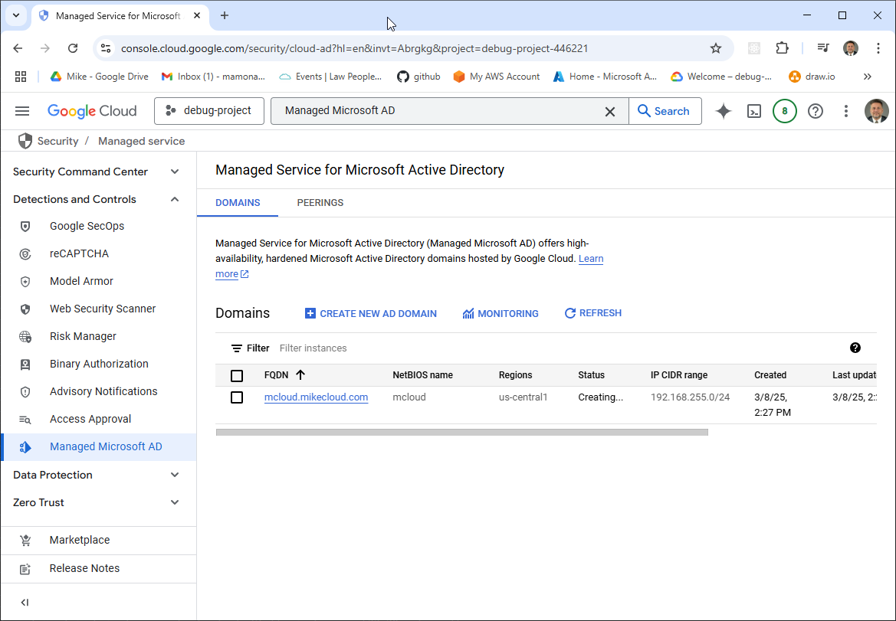
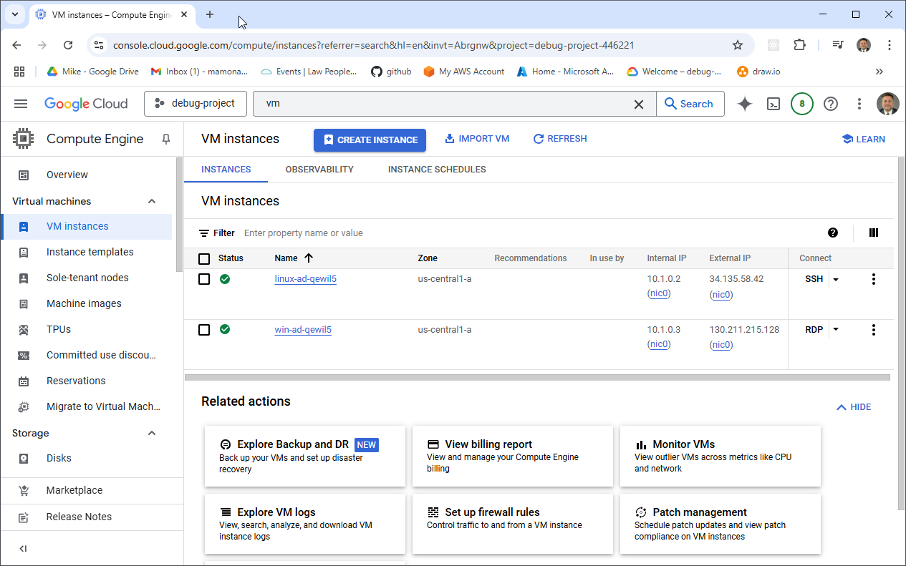
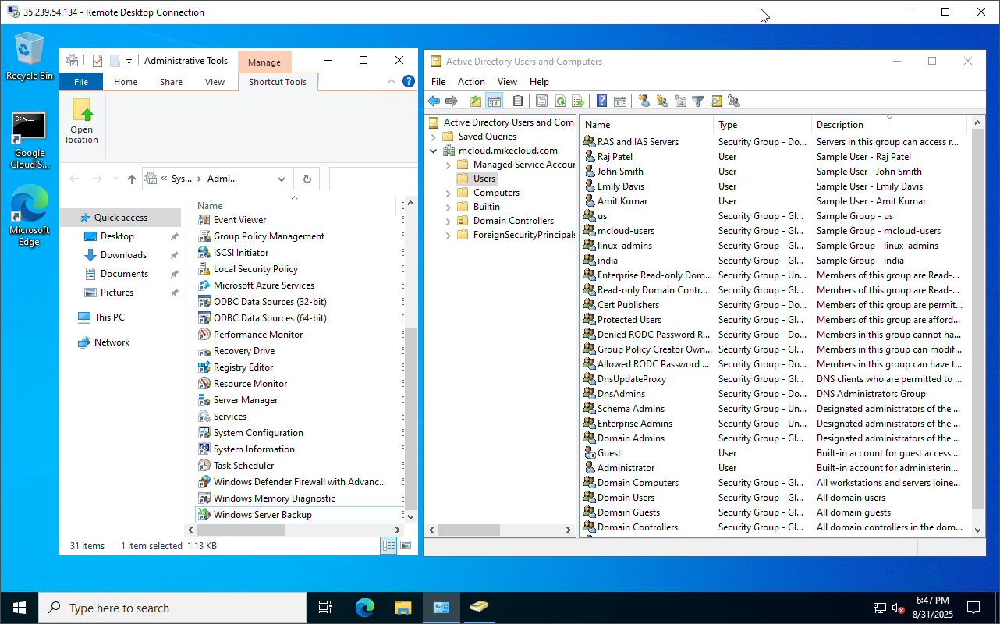
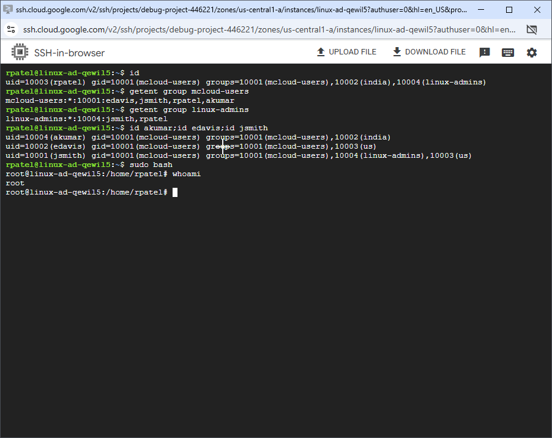

# **Google Managed Microsoft AD**  

This is Part 3 of the Series: [Deploying Active Directory in the Cloud](https://youtu.be/H5lKJPJBL5s)  

## **Introduction**  

In this video, we will demonstrate the deployment of **Google Managed Microsoft Active Directory (Managed AD)**, a fully managed **Active Directory** solution in Google Cloud, while covering the following tasks:  

- **Configure secure networking** by setting up subnets, firewall rules, and Cloud DNS to ensure seamless domain connectivity.  
- **Deploy Google Managed Microsoft AD** to support domain-joined workloads.   
- **Join both Windows and Linux servers** to the Active Directory domain.  
- **Configure SSSD** ([System Security Services Daemon](https://sssd.io/)) for Linux authentication with Active Directory.  
- **Integrate with Google Secret Manager** to securely store and retrieve administrator credentials.  
- **Manage directory objects and policies**, including users, groups, and Organizational Units (OUs).  
- **Clean up resources** by decommissioning all infrastructure provisioned during the process.  

This tutorial will help you understand **Google Managed Microsoft AD** and how to use it for **identity management in Google Cloud environments**.  


## Prerequisites

* [A Google Cloud Account](https://console.cloud.google.com/)
* [Install gcloud CLI](https://cloud.google.com/sdk/docs/install) 
* [Install Latest Terraform](https://developer.hashicorp.com/terraform/install)

If this is your first time watching our content, we recommend starting with this video: [GCP + Terraform: Easy Setup](https://youtu.be/3spJpYX4f7I). It provides a step-by-step guide to properly configure Terraform, Packer, and the gcloud CLI.

## Download this Repository

```bash
git clone https://github.com/mamonaco1973/gcp-directory.git
cd gcp-directory
```

## Build the Code

Run [check_env](check_env.sh) and [api_setup](api_setup.sh) then run [apply](apply.sh).

```bash
develop-vm:~/gcp-directory$ ./check_env.sh
NOTE: Validating that required commands are found in the PATH.
NOTE: gcloud is found in the current PATH.
NOTE: terraform is found in the current PATH.
NOTE: All required commands are available.
NOTE: Validating credentials.json and test the gcloud command
Activated service account credentials for: [terraform-build@debug-project-446221.iam.gserviceaccount.com]
develop-vm:~/gcp-directory$ ./api_setup.sh
NOTE: Validating credentials.json and test the gcloud command
Activated service account credentials for: [terraform-build@debug-project-446221.iam.gserviceaccount.com]
NOTE: Enabling APIs needed for build.
Updated property [core/project].
develop-vm:~/gcp-directory$ ./apply.sh
NOTE: Validating that required commands are found in the PATH.
NOTE: gcloud is found in the current PATH.
NOTE: terraform is found in the current PATH.
NOTE: All required commands are available.
NOTE: Validating credentials.json and test the gcloud command
Activated service account credentials for: [terraform-build@debug-project-446221.iam.gserviceaccount.com]
Initializing the backend...
Initializing provider plugins...
- Finding latest version of hashicorp/random...
- Finding latest version of hashicorp/google...
- Installing hashicorp/random v3.7.1...
- Installed hashicorp/random v3.7.1 (signed by HashiCorp)
- Installing hashicorp/google v6.24.0...
- Installed hashicorp/google v6.24.0 (signed by HashiCorp)
Terraform has created a lock file .terraform.lock.hcl to record the provider
selections it made above. Include this file in your version control repository
so that Terraform can guarantee to make the same selections by default when
you run "terraform init" in the future.

Terraform has been successfully initialized!
[...]
```

### Build Process Overview  

The build process consists of two phases:  

1. **Phase 1:** Use Terraform to provision the required networking and deploy the Managed Active Directory instance. This phase takes approximately **20-40 minutes** to complete.  
2. **Phase 2:** Once the directory service is provisioned, deploy a Linux and a Windows VM instance. Their respective **startup scripts** will automatically join them to the domain during initialization.  

## Tour of Build Output in the GCP Console

- **The Managed Active Directory Instance**
- **Secrets Manager**
- **The Windows VM Instance**
- **The Linux VM Instance**



 

### Retrieving Initial Admin Credentials

Once **Google Managed Microsoft AD** is provisioned, Google automatically creates the **`setupadmin`** account within the directory. This account has **Domain Admin** privileges, allowing you to perform administrative tasks like creating Organizational Units (OUs), managing Group Policy, and adding users.  

The initial password for the `setupadmin` account can be retrieved directly via **gcloud CLI** (`gcloud active-directory domains reset-admin-password "mcloud.mikecloud.com"`) or the **Google Cloud Console**.  

In this project, we automate this by storing the **`setupadmin`** credentials in **Google Secret Manager** using a secret named `admin_ad_credentials`.

This allows Terraform and shell scripts to dynamically retrieve credentials for subsequent automation steps, such as joining servers to the domain.

### Users and Groups

As part of this project, when the Windows instance boots and successfully joins Active Directory, a set of **users** and **groups** are automatically created through a scripted process. These resources are intended for **testing and demonstration purposes**, showcasing how to automate user and group provisioning in a cloud-integrated Active Directory environment.

#### Groups Created

| Group Name    | Group Category | Group Scope | gidNumber |
|----------------|----------------|----------------|------------|
| mcloud-users   | Security       | Universal     | 10001 |
| india          | Security       | Universal     | 10002 |
| us             | Security       | Universal     | 10003 |
| linux-admins   | Security       | Universal     | 10004 |

#### Users Created and Group Memberships

| Username | Full Name   | uidNumber | gidNumber | Groups Joined                    |
|---------|------------|-----------|-----------|----------------------|
| jsmith  | John Smith  | 10001 | 10001 | mcloud-users, us, linux-admins |
| edavis  | Emily Davis | 10002 | 10001 | mcloud-users, us |
| rpatel  | Raj Patel   | 10003 | 10001 | mcloud-users, india, linux-admins |
| akumar  | Amit Kumar  | 10004 | 10001 | mcloud-users, india |

---


#### Understanding `uidNumber` and `gidNumber` for Linux Integration

The **`uidNumber`** (User ID) and **`gidNumber`** (Group ID) attributes are critical when integrating **Active Directory** with **Linux systems**, particularly in environments where **SSSD** ([System Security Services Daemon](https://sssd.io/)) or similar services are used for identity management. These attributes allow Linux hosts to recognize and map Active Directory users and groups into the **POSIX** (Portable Operating System Interface) user and group model.

### Log into Windows Instance  

After the Windows instance boots, the [startup script](02-servers/scripts/ad_join.ps1) executes which does the following tasks   

- Install Active Directory Administrative Tools  
- AWS CLI Installation  
- Join EC2 Instance to Active Directory  
- Create Active Directory Groups  
- Create Active Directory Users and Assign to Groups  
- Grant RDP Access  
- Final System Reboot  

Administrator credentials are stored in the `admin_ad_credentials` secret.



### Log into Linux Instance  

When the Linux instance boots, the [startup script](02-servers/scripts/ad_join.sh) runs the following tasks:  

- Update OS and install required packages  
- Install AWS CLI  
- Join the Active Directory domain with SSSD  
- Enable password authentication for AD users  
- Configure SSSD for AD integration  
- Grant sudo privileges to the `linux-admins` group  

Linux user credentials are stored as secrets.

 

## Run the "destroy" script when you are done

```bash
develop-vm:~/gcp-directory$ ./destroy.sh
Initializing the backend...
Initializing provider plugins...
- Reusing previous version of hashicorp/google from the dependency lock file
- Reusing previous version of hashicorp/random from the dependency lock file
- Using previously-installed hashicorp/google v6.24.0
- Using previously-installed hashicorp/random v3.7.1

Terraform has been successfully initialized!

You may now begin working with Terraform. Try running "terraform plan" to see
any changes that are required for your infrastructure. All Terraform commands
should now work.

If you ever set or change modules or backend configuration for Terraform,
rerun this command to reinitialize your working directory. If you forget, other
commands will detect it and remind you to do so if necessary.
random_string.vm_suffix: Refreshing state... [id=qewil5]
data.google_compute_network.ad_vpc: Reading...
data.google_compute_image.ubuntu_latest: Reading...
data.google_compute_image.windows_2022: Reading...
[...]
```

